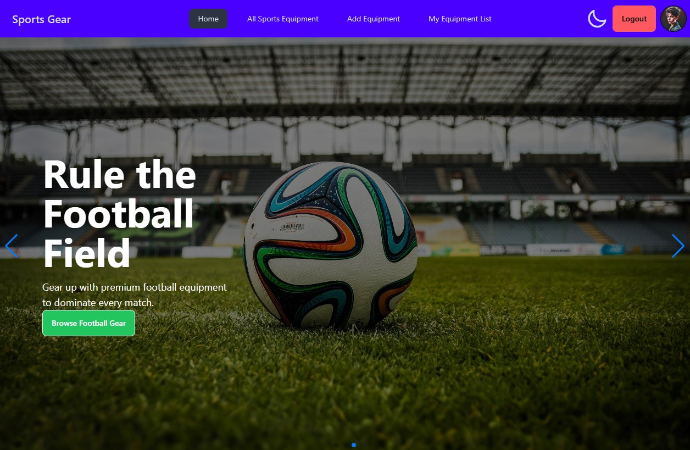

# 🏆 Sports Gear

**Live Site URL:**  
[🔗 Sports Gear](https://sports-equipments-4a037.web.app/)

## 📞 Contact Information

You can reach me at:  
📱 **Phone Number:** +8801689819951  

---

## 📌 Overview

**Sports Gear** is a full-stack web application designed for showcasing, managing, and exploring sports equipment seamlessly. It offers:  

✔️ **User-friendly navigation**  
✔️ **Secure authentication with private routes**  
✔️ **Engaging UI animations**  
✔️ **Efficient sorting and search functionalities**  
✔️ **Dark/Light mode support**  



---

## 📚 Table of Contents

- [Technology Stack](#-technology-stack)  
- [Features](#-features)  
- [Pages & Functionalities](#-pages-and-functionalities)  
- [Challenges & Integrations](#-challenges-and-integrations)  
- [Installation](#-installation)  
- [Dependencies](#-dependencies)  

---

## 🛠 Technology Stack

### **Frontend (Client-Side)**  
- 🚀 **React.js** – UI framework  
- 🚏 **React Router** – Navigation and routing  
- 🎨 **Tailwind CSS** – Styling and responsive design  
- 🔄 **Redux / Context API** – State management  
- 🔑 **Firebase Authentication** – Secure authentication  
- 🔗 **Axios / Fetch API** – API requests  
- 🎭 **React Awesome Reveal** – UI animations  

### **Backend (Server-Side)**  
- ⚡ **Node.js** – Server runtime  
- 🌐 **Express.js** – API handling  
- 🗄 **MongoDB** – Database  
- 🔒 **JWT (JSON Web Token)** – Authentication & authorization  
- 🛠 **Dotenv** – Environment variable management  

---

## ✨ Features

- **🔝 Dynamic Navbar** – Displays "Login", "Register", and user profile based on authentication.  
- **🏠 Home Page** – Banner slider, product highlights, and sports categories.  
- **🔐 Authentication System** – Secure login via email, password, and Google/GitHub.  
- **📝 CRUD Operations** – Add, view, update, and delete sports equipment.  
- **🌙 Dark/Light Mode** – Toggle between themes for better UI experience.  
- **🔎 Sorting & Search** – Sort items by price and explore the collection easily.  
- **💡 Animations** – Engaging UI with Lottie React & React Awesome Reveal.  
- **📱 Responsive Design** – Optimized layout for all devices.  

---

## 📄 Pages and Functionalities

### **1️⃣ Navbar**
- Displays **website logo, navigation links, user photo, and logout button**.
- Shows conditional buttons for authentication.

### **2️⃣ Home Page**
- **🏞 Banner slider** with dynamic slides.
- **📦 Product showcase** with "View Details" option.
- **🏆 Additional sections** for enriched content.

### **3️⃣ Authentication (Login & Register)**
- **Login:** Email, password, and one-click Google/GitHub authentication.  
- **Register:** Includes **photo URL input** and **password validation**.

### **4️⃣ Private Routes**
- **➕ Add Equipment** – Secure form to add items.  
- **🛍 My Equipment List** – Manage personal sports items (update & delete).  
- **🔍 View Details** – Detailed view of individual equipment.  

### **5️⃣ All Sports Equipment Page**
- **📊 Table format** listing all equipment.  
- **🔎 Sorting feature** for better browsing.  
- **👀 "View Details" button** to explore individual items.  

### **6️⃣ 404 Page**
- **Custom error page** for handling non-existing routes.

### **7️⃣ Loading Spinner**
- **Smooth loading animations** while fetching data.  

---

## 🚀 Challenges and Integrations

✔️ **Sort functionality** added on the equipment page.  
✔️ **Integrated React Tooltip** for user guidance.  
✔️ **Enhanced UI with animations** from React Awesome Reveal & Lottie React.  

---

## 🛠 Installation Guide

### **Clone the repository**
```bash
git clone https://github.com/your-username/your-repo.git
cd your-repo
```

### **Install dependencies**
```bash
npm install
```

### **Start the development server**
```bash
npm run dev
```

---

## 📦 Dependencies

### **Main Dependencies**
```json
{
  "firebase": "^11.0.2",
  "localforage": "^1.10.0",
  "lottie-react": "^2.4.0",
  "match-sorter": "^8.0.0",
  "react": "^18.3.1",
  "react-dom": "^18.3.1",
  "react-icons": "^5.4.0",
  "react-router-dom": "^7.0.2",
  "react-tooltip": "^5.28.0",
  "sort-by": "^1.2.0",
  "sweetalert2": "^11.14.5",
  "swiper": "^11.1.15"
}
```

### **Development Dependencies**
```json
{
  "@eslint/js": "^9.15.0",
  "@types/react": "^18.3.12",
  "@types/react-dom": "^18.3.1",
  "@vitejs/plugin-react": "^4.3.4",
  "autoprefixer": "^10.4.20",
  "daisyui": "^4.12.14",
  "eslint": "^9.15.0",
  "eslint-plugin-react": "^7.37.2",
  "eslint-plugin-react-hooks": "^5.0.0",
  "eslint-plugin-react-refresh": "^0.4.14",
  "globals": "^15.12.0",
  "postcss": "^8.4.49",
  "tailwindcss": "^3.4.15",
  "vite": "^6.0.1"
}
```

---